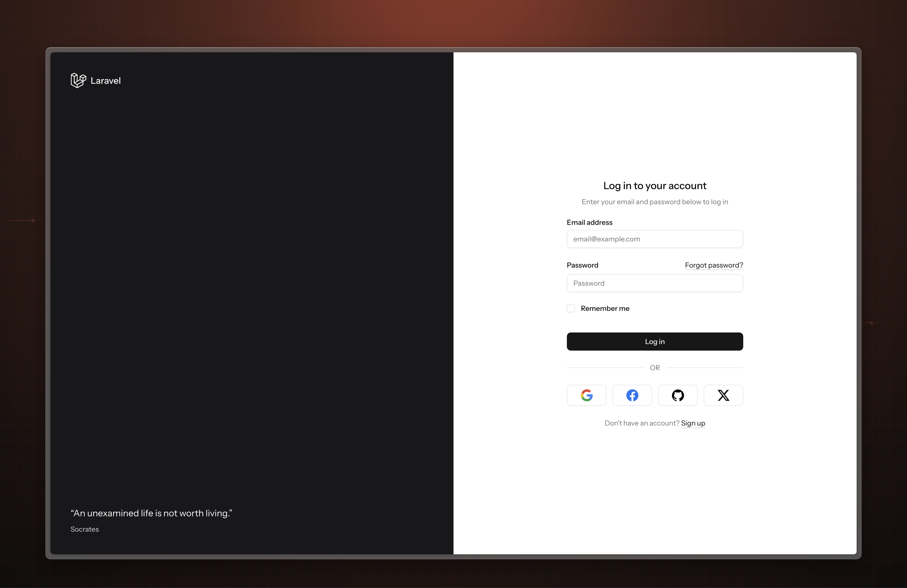
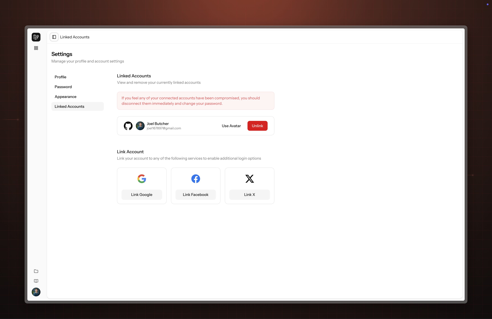

# Laravel Socialite UI

<a href="https://github.com/Laravel-Uis/socialite-ui/actions">
    
</a>
<a href="https://packagist.org/packages/Laravel-Uis/socialite-ui">
    
</a>
<a href="https://packagist.org/packages/Laravel-Uis/socialite-ui">
    
</a>
<a href="https://packagist.org/packages/Laravel-Uis/socialite-ui">
    
</a>

Laravel Socialite UI is a third-party Laravel package that connects the dots between Laravel Socialite and the new Laravel Starter Kits.
It provides a simple way to add social authentication to your Laravel application.

Laravel Socialite UI supports the new React, Vue, Livewire (Volt) and Livewire (class-components) starter kits.

> [!NOTE]
> Laravel Socialite UI is a third-party package and is not officially supported by Laravel.

## Documentation



### Pre-requisites

This guide assumes you have a basic understanding of Laravel and Composer.
If you are new to Laravel, you can learn more about it by visiting the [official Laravel documentation](https://laravel.com/docs).

We also assume you have at least [PHP 8.2](https://www.php.net/releases/8.2/en.php) installed on your machine,
along with [Composer V2](https://getcomposer.org/),
[Node](https://nodejs.org/en), and [NPM](https://www.npmjs.com/) (or [Bun](https://bun.sh/)).

### Laravel Herd

If you are starting from scratch, we recommend installing [Laravel Herd](https://herd.laravel.com) to help manage these pre-requisites.

Laravel Herd offers a quick and easy way to get started with local PHP development with zero dependencies (no more Homebrew, Valet, Docker, etc).

### Getting Started

We've worked incredibly hard to make it as easy as possible to add support for Laravel Socialite into your starter kit application.

To start using Laravel Socialite UI, create a new composer project using any of the starter kit templates and compile your frontend assets:

**React**
```bash
composer create-project laravel-uis/socialite-ui-react-starter-kit:dev-main example-app
npm install && npm run buil
```

**Vue**
```bash
composer create-project laravel-uis/socialite-ui-vue-starter-kit:dev-main example-app
npm install && npm run buil
````

**Livewire (Volt)**
```bash
composer create-project laravel-uis/socialite-ui-livewire-starter-kit:dev-main example-app
npm install && npm run buil
```

**Livewire (classes)**
```bash
composer create-project laravel-uis/socialite-ui-livewire-starter-kit:dev-components example-app
npm install && npm run buil
```

### Features

Laravel Socialite UI comes pre-configured with a bunch of useful features, ready for your next great idea:

#### **1. "Remember Me" functionality**
Laravel Socialite UI includes a "Remember Me" feature that allows users to stay logged in, even after they close their browser.
This setting is enabled by default, but can be disabled in the `config/socialite-ui.php` configuration file, simply remove this line:

```php
Features::rememberSession(),
```

#### **2. Global Login**

Laravel Socialite UI includes a global login feature that allows users to log into your application from any page.
This setting is enabled by default, but can be disabled by removing the `Features::globalLogin()` line from your config file.

#### **3. Generate Missing Emails**

Some social providers do not return an email address for the user by default and require additional configuration in order to do so. Laravel Socialite UI includes a feature that generates a unique email address for these users.
This setting can be disabled by removing the `Features::generateMissingEmails()` line from your config file.

#### **4. Refresh OAuth Tokens**

Laravel Socialite UI includes a feature that automatically refreshes OAuth tokens when they expire when a user
logs into your application. Disable this setting by removing the `Features::refreshOAuthTokens()` line from your config file.

#### **5. Create on login**

If you have opted out of the Global Login feature of Socialite UI, you can still allow new users to be created from the login screen by uncommenting the `Features::createAccountOnFirstLogin(),` line in your config file.

### Customization

Laravel Socialite UI is highly customizable and can be tailored to suit your application's needs.

#### **1. User model**

By default, Laravel Socialite UI uses the `App\Models\User` model for authentication and account creation. However, you may wish to use a different model.
To do so, you may call the `SocialiteUI::useUserModel` method from the `boot` method of you application's `AppServiceProvider`, passing in the fully qualified class name of your desired model.

```php
use SocialiteUI\SocialiteUI;

SocialiteUI::useUserModel(Path\To\Your\User::class);
```

#### **2. Social Account model**

Similarly, you may define a different model to be used for storing the details of linked social accounts
by calling the `SocialiteUI::useSocialAccountModel` method from the `boot` method of you application's `AppServiceProvider`.

```php
use SocialiteUI\SocialiteUI;

SocialiteUI::useSocialAccountModel(Path\To\Your\SocialAccount::class);
```

#### **3. Customizing the actions**

To keep your codebase clean, Socialite UI uses internal classes to perform specific actions when authenticating a user with a new, or known social account.

However, you are free to override these actions at any point.

Typically, you would call any of these methods within the `boot` method of a service provider.

```php
use SocialiteUI\SocialiteUI;

// Customize how Socialite UI generates the redirect URL for a provider
SocialiteUi::generatesProvidersRedirectsUsing(...);

// Customize how Socialite UI resolves users from Socialite
SocialiteUi::resolvesSocialiteUsersUsing(...);

// Customize how Socialite UI creates users from Socialite
SocialiteUi::createUsersFromProviderUsing(...);

// Customize how Socialite UI creates social accounts from Socialite
SocialiteUi::createSocialAccountsUsing(...);

// Customize how Socialite UI updates social accounts from Socialite
SocialiteUi::updateSocialAccountsUsing(...);

// Customize how Socialite UI handles the `Laravel\Socialite\Two\InvalidStateException` when attempting to resolve a user from Socialite.
SocialiteUi::handlesInvalidStateUsing(...);

// Override the callback logic used by Socialite UI to authenticate users.
SocialiteUi::authenticatesOAuthCallbackUsing(...);

// Customize how Socialite UI handles errors when returning from a failed login attempt from a provider.
SocialiteUi::handlesOAuthCallbackErrorsUsing(...);

// Use a custom prompt your users are shown when they attempt to link a new provider from the "Linked Accounts" screen.
SocialiteUi::promptOAuthLinkUsing(...);
```

## Contributing

Thank you for considering contributing to Socialstream! You can read the contribution guide [here](.github/CONTRIBUTING.md).

## Code of Conduct

In order to ensure that the Laravel development community is welcoming to all, please review and abide by the [Code of Conduct](.github/CODE_OF_CONDUCT.md).
